# Parcial 1
**Universidad Icesi**

**Nombre:** Laura Isabella Tabares P.

**Código:** A00054120

**Correo:** laura.tabares@correo.icesi.edu.co
 
**URL:** https://github.com/Lauraitp/so-exam1

_____

## Pasos para la validación de la imagen.
### Punto 3

1. Descargar Debian 9 en (https://cdimage.debian.org/debian-cd/current/amd64/iso-cd/) y tener muy en cuenta la ubicación de la carpeta donde se descargó.


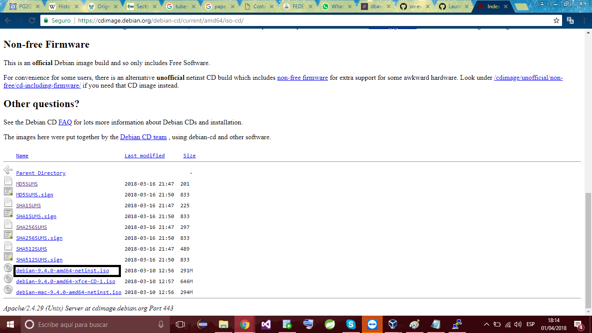


Nota: Manera Nº 1 de realizar la validación de la imagen

2.1. Usar desde la terminal de windows los comandos:
```console
powershell
```
Luego,  ir a la carpeta donde esta la imagen del sistema operativo y utilizar el comando:

```console
Get-FileHash .\debian-9.4.0-amd64-netinst.iso
```
3.1. buscar el CheckSum del algoritmo SHA256: https://cdimage.debian.org/debian-cd/current/amd64/iso-cd/SHA256SUMS
4. Comparar.

Se puede comparar algorirmos como SHA1:

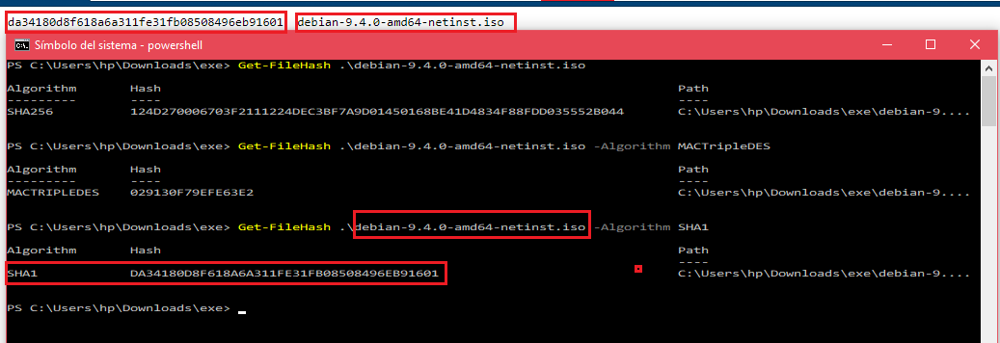


o SHA256:

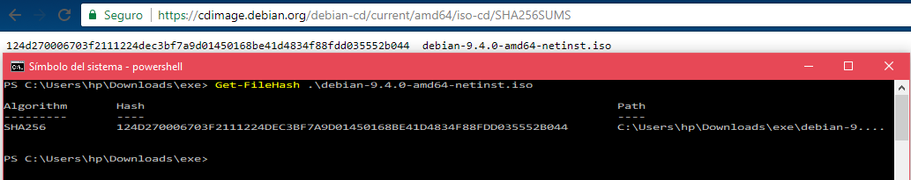


Forma Nº 2 de realizar la validación de los comandos:

2.2. Descargar la siguiente herramienta (https://download.cnet.com/MD5-SHA-Checksum-Utility/3001-2092_4-10911445.html) para comparar los checksums.

3.2. Una vez ejecutemos el instalador, buscamos la imagen (el .iso) y lo comparamos con el checksum que descargamos en el punto 2.1.
 
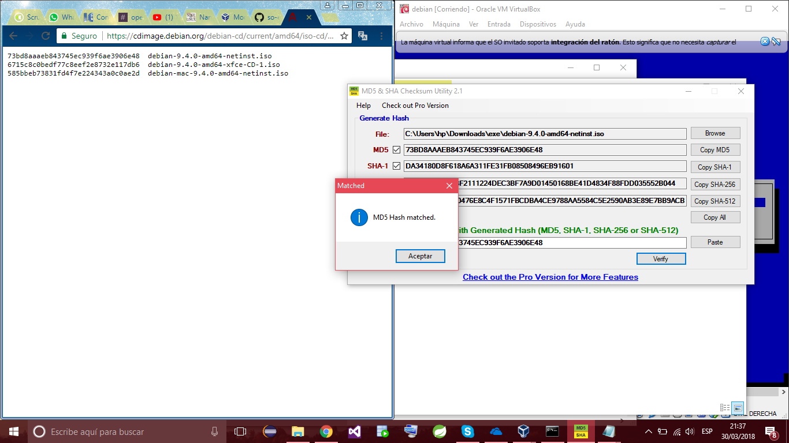

## Instalación.
### Punto 4
1. Cuando queremos instalar una nueva máquina virtual en VirtualBox, lo que hay que hacer, es seguir las siguientes imágenes:

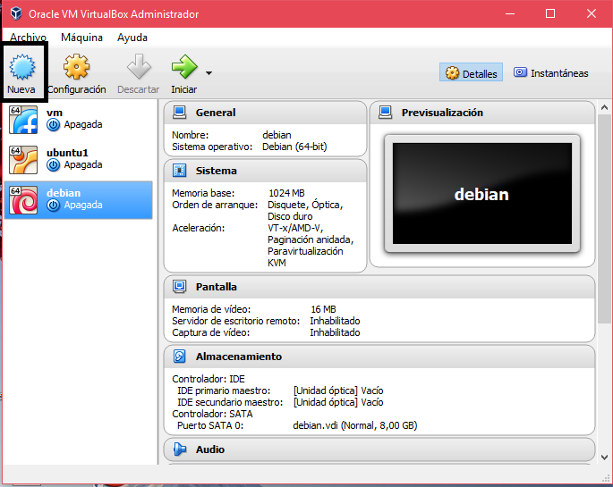

	1.1. Nombrar la máquina
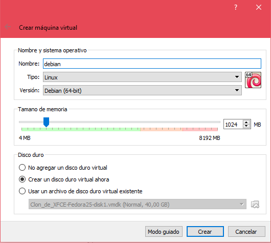

	1.2. Almacenar la imagen
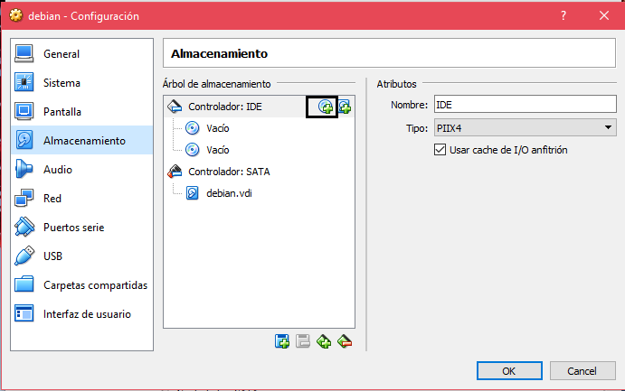

	1.3. Configurar la Red de la imagen (esto puede hacerse después, habitualmente lo hago en este paso).
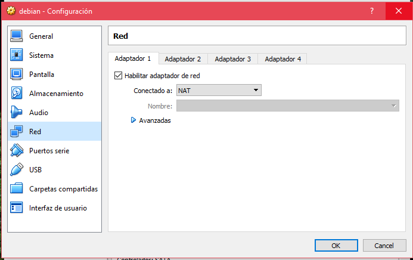

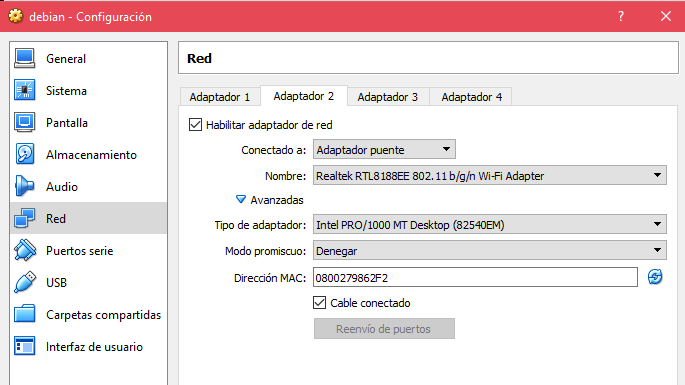


2. Iniciar Debian

3. Seleccionar el lenguaje con el cual instalaremos Debian, yo seleccioné español.

4. seleccionar el país, en mi caso Colombia y la distribución del teclado Latinoamérica.

5. Asignar la clave del superusuario(root) en mi caso deje root.

6. Indicar el nombre de la persona real a la cual se le asignara dicho usuario. En mi caso, Laura Tabares.

7. Una vez pasado este proceso de instalación, seguí las opciones recomendadas.

8. Luego de esperar aproximadamente 2 horas (mi pc es demaaaasido lento) por fin, queda instalada la máquina virtual.

9. Ya en la Terminal del sistema operativo, para tener todos los accesos del root, se ingresa el siguiente comando:
```Console
su root
```

10. Luego ingresamos la contraseña que desde el momento de la instalación le dimos.

11. Comprobamos la información del sistema operativo con el siguiente comando:
```Console
uname -a
```


12. Comprobamos nuestra instalación como ÉXITOSA!


## SSH

### Punto 5

1. Como se pudo ver en el punto anterior, subpunto 1.1 la configuración del adaptador puente, podremos seguir para conectarlo con Putty

2. Después de obtener el instalador Putty y con la dirección ip del sistema operativo. La ingresamos en Putty y debería funcionar.

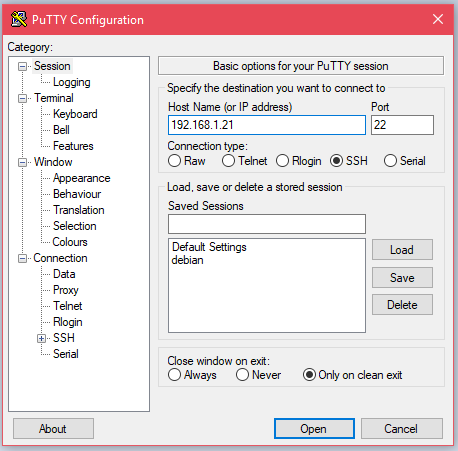

3. Dado el caso que no funcione el Putty y le aparezca u error como: "Network error: Connection refused". Se deberá usar los siguientes comandos desde Debian:

```Console
apt-get install openssh-client
```

```Console
apt-get install openssh-server
```

```Console
service shh start
```
Ya después de los comando me sirvió el PUTTY.


Para más información: https://wiki.debian.org/es/SSH


## Instalar git y tig

### Punto 6

1. Ya en el Putty e ingresando el usuario y la contraseña correspondiente del debian. El siguiente comando:
```Console
apt-get install git tig -y
```

Con el fin de instalar los dos de una vez y confirmar la instalación


2. En la siguiente imagen se muestra los commit realizados con el comando:
```Console
tig
```

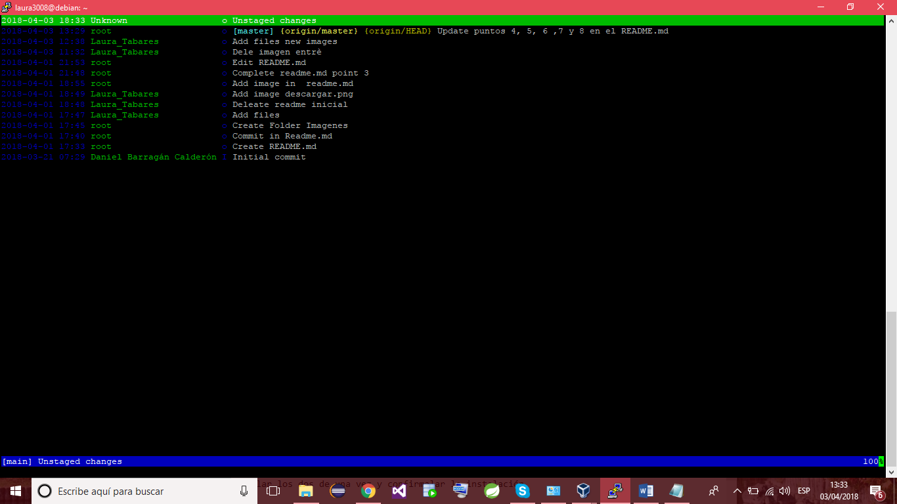

## Exportar la máquina virtual e importarla

### Punto 7

## EXPORTAR

1. Para exportarla primero debemos ir al VirtualBox y hacer clic en archivo en la parte superior izquierda. Luego clic en exportar como lo podemos ver en la siguiente imagen.

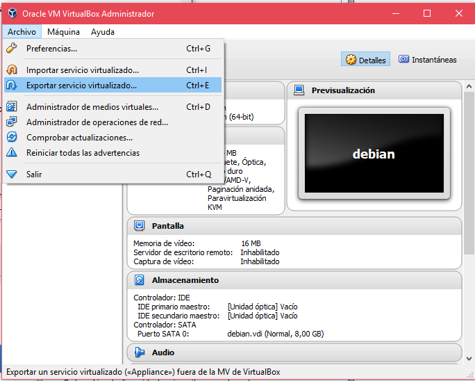.

2. Seleccionar la máquina virtual Debian y elegir el lugar donde desea guardarla.

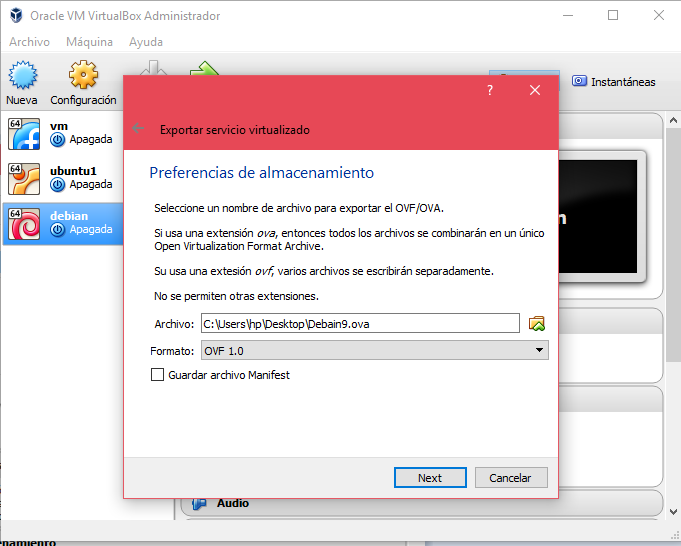

3. Clic en exportar y empieza a exportar el .ova

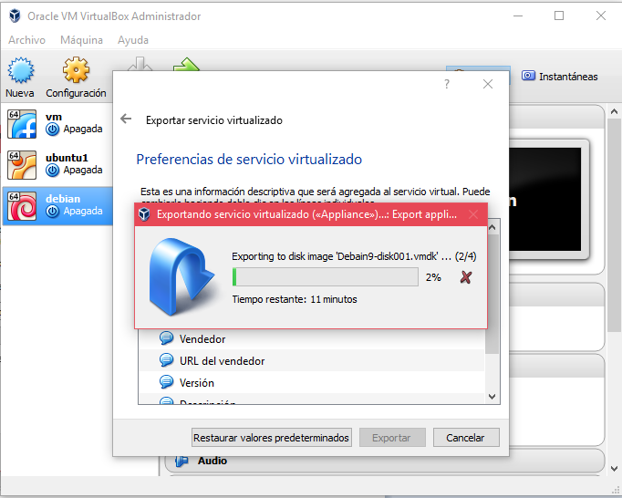

## IMPORTAR


## Cuadro comparativo

### Punto 8

| Factores | CentOS7 | Debian 9 |
| ------- |----------|----------|
| Compatibilidad con arquitecturas | x86-64 | mips64,  x86 (i386 y amd64), ARM 64 bits (arm64), ARM EABI (ARMEL), ARMv7 (armhf), MIPS big-endian y mipsel (little-endian), PowerPC little-endian de 64 bits (ppc64el) e IBM System z (s390x) |
| Kernel | Linux 3.10 | Linux 4.9 LTS |
| Interfaz gráfica | GNOME | Gnome 3.22, KDE Plasma 5.8 LTS, Xfce 4.12 |
| Distribución Basada | Red Hat Enterprise Linux | Linux (1993) |
| Versiones livianas | 422 MB | 291 MB |
| Versión compilador C | GCC 4.1.1 | GCC 4.1.1, 3.4.6, 3.3.6, 2.95 |
| Controlador de paquetes |  yum | apt-get, aptitude|
| Modificaciones | EPEL | Backports |


